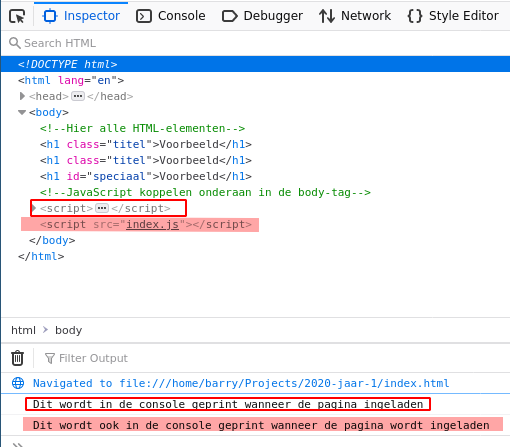
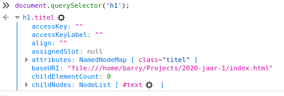
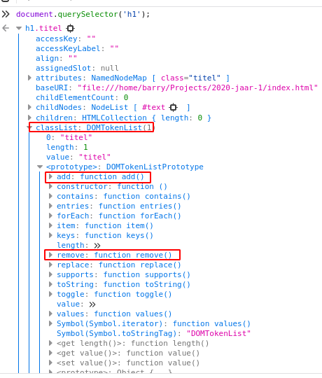
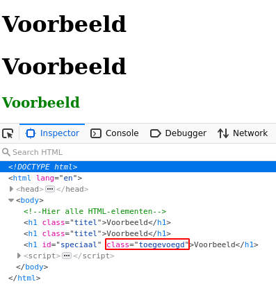
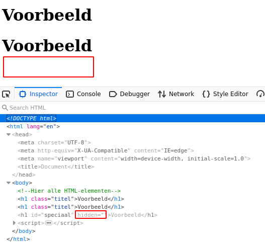

<br/>
<br/>
<br/>
<br/>
<br/>
<br/>
<br/>
<br/>
<br/>
<br/>
<br/>

# HTML/CSS

## Bart Duisters

<br/>
<br/>
<br/>
<br/>
<br/>
<br/>
<br/>
<br/>
<br/>
<br/>
<br/>
<br/>
<br/>
<br/>
<br/>
<br/>
<br/>
<br/>
<br/>
<br/>
<br/>
<br/>
<br/>
<br/>
<br/>
<br/>
<br/>
<br/>
<br/>
<br/>
<br/>
<br/>
<br/>
<br/>
<br/>
<br/>
<br/>
<br/>
<br/>

# Basisstructuur

HTML staat voor Hyper Text Markup Language. Het beschrijft de structuur van een
webpagina aan de hand van elementen.

Elementen bestaan uit een begin- en eindtag.

Een voorbeeld van een element is `<title>Voorbeeld 1</title>`, met `<title>` als
begintag en `</title>` als eindtag. `Voorbeeld 1` is de inhoud van het element.

```html
<!DOCTYPE html>
<html>
  <head>
    <title>Voorbeeld 1</title>
  </head>
  <body>
    <h1>Basisstructuur</h1>
    <p>
      Dit voorbeeld bevat de essentiële elementen om een webpagina te tonen met
      een titel en inhoud.
    </p>
  </body>
</html>
```

Om dit voorbeeld als webapagina te zien:

- maak een bestand aan genaamd `index.html`
- kopieer bovenstaande HTML en plak het als inhoud van het aangemaakte HTML-bestand
- sla het bestand op en open het in een webbrowser


# DOCTYPE

```html
<!DOCTYPE html>
<!-- ... -->
```

Alles tussen `<!-- -->` wordt gezien als commentaar in HTML.

Het DOCTYPE geeft aan dat het documentype `html` is, hierdoor weet de webbrowser
hoe deze pagina weergegeven moet worden. Dit komt één keer voor,
bovenaan het document. `<!DOCTYPE html>` is de declaratie voor `HTML5`.

Oudere declaraties zien er iets ingewikkelder uit:

```html
<!DOCTYPE html PUBLIC "-//W3C//DTD HTML 4.01 Transitional//EN" "http://www.w3.org/TR/html4/loose.dtd">
```

```html
<!DOCTYPE html PUBLIC "-//W3C//DTD XHTML 1.1//EN" "http://www.w3.org/TR/xhtml11/DTD/xhtml11.dtd">
```

Dit komt omdat de oudere declaraties moeten verwijzen naar een DTD
(Document Type Definition).

Aangezien HTML5 de standaard is tegenwoordig, is het voldoende om enkel
`<!DOCTYPE html>` te onthouden.

# Elementen

Een element bestaat uit een begin- en eindtag.

```html
<head>
  <title>Voorbeeld 1</title>
</head>
```

`<head></head>` het `head`-element.
`<head>` de begintag van het `head`-element.
`</head>` de eindtag van het `head`-element.

Er zijn ook elementen zonder eindtag. Dit noemt men een leeg element.

`<br>`

De `<br>`-tag zal een lege lijn toevoegen.

Een leeg element kan ook als een "self closing element"
(Nederlands: element dat zichzelf afsluit) geschreven worden.

`<br />`

Dit is beide geldige HTML5.

## `<head>`-tag

```html
<!-- ... -->
<head>
  <title>Voorbeeld 1</title>
</head>
<!-- ... -->
```

Het element `head` bevat informatie over de webpagina. In het voorbeeld is hier
het element `title` terug te vinden, met daarin de inhoud `Voorbeeld 1`.

Hierin kunnen ook nog andere elementen geplaatst worden:

- `<style>`-tags om te verwijzen naar CSS-bestanden, om de stijling van de
  website anders te maken (bijvoorbeeld een roze achtergrond i.p.v. een witte).
  Dit komt terug in het onderdeel CSS binnen deze module.
- `<script>`-tags om te verwijzen naar JavaScript-bestanden. Dit komt in de
  module JavaScript terug.
- `<meta>`-tags om extra informatie over de webpagina te geven.

Enkele voorbeelden van `<meta>`-tags:

```html
<!-- ... -->
<head>
  <meta charset="UTF-8" />
  <meta name="viewport" content="width=device-width, initial-scale=1.0" />
</head>
<!-- ... -->
```

De `charset` duidt aan welke `character encoding` gebruikt wordt. `UTF-8` is
een van de meestgebruikte karaktersets.

De `viewport` bepaalt hoe de inhoud getoond moet worden, het gebruikte voorbeeld
is om de inhoud duidelijk te tonen op mobiele toestellen.

## Hoofdingen

Om verschillende groottes van titels te tonen, kan er gebruik gemaakt worden van
`<h1>` t.e.m. `<h6>`.

```html
<h1>Hoofding 1</h1>
<h2>Hoofding 2</h2>
<h3>Hoofding 3</h3>
<h4>Hoofding 4</h4>
<h5>Hoofding 5</h5>
<h6>Hoofding 6</h6>
```


## Paragrafen

Een paragraaf toont aan dat alle tekst binnen de begin- en eindtag van de
paragraaf, bij elkaar hoort.

```html
Deze twee regels lijken hetzelfde in de browser, toch is er een verschil!
<p>Deze twee regels lijken hetzelfde in de browser, toch is er een verschil!</p>
```

De tweede regel omschrijft voor de browser dat hetgeen getoond wordt, in de
context van een paragraaf is. De eerste regel toont gewoon een regel tekst.
De browser heeft geen informatie over wat de tekst voorstelt.


## Links

Via links, hyperlinks, kan verwezen worden naar andere elementen of
volledige andere pagina's.

```html
<a href="https://9gag.com/gag/a9W9WyL">Dit is de getoonde tekst.</a>
```

Merk op dat een link die nog niet bezocht is, blauw is. En zodra de link
bezocht is, wordt deze paars. Dit wordt automatisch afgehandeld.


## Afbeeldingen

```html

```

De ``-tag is een leeg element. In het voorbeeld wordt geopteerd voor de
`self closing` variant.

`src` geeft de `source` (Nederlands: bron) aan waar de afbeelding gevonden kan
worden.

`alt` geeft de **alt**ernatieve tekst aan die getoond moet worden indien de
afbeelding te traag wordt ingeladen.

# Attributen

Elementen kunnen attributen bevatten. In de bovenstaande voorbeelden is dit
terug te vinden bij:

```html
<meta charset="UTF-8" />
<!-- charset is een attribuut met als waarde "UTF-8" -->

<meta name="viewport" content="width=device-width, initial-scale=1.0" />
<!-- name is een attribuut met als waarde "viewport" -->
<!-- content is een attribuut met als waarde "width=device-width, initial-scale=1.0" -->
```

```html
<a href="https://9gag.com/gag/a9W9WyL">Dit is de getoonde tekst.</a>
<!-- href is een attribuut met als waarde de locatie van de website -->
```

```html

<!-- src is een attribuut met als waarde de afbeelding die getoond moet worden -->
<!-- alt is een attribuut met als waarde de tekst die getoond moet worden -->
```

# Lijsten

Er zijn twee soorten lijsten:

- Lijsten met ordering (Engels: ordered list)
- Lijsten zonder ordering (Engels: unordered list)

**O**rdered **L**ist, `<ol>`-element wordt gebruikt om een lijst met nummers
te tonen.

**U**nordered **L**ist, `<ul>`-element wordt gebruikt om een lijst zonder
nummers te tonen.

In beide gevallen kan een item toegevoegd worden, een **L**ist **I**tem: `<li>`.

```html
<h1>Cursisten</h1>

<ul>
  <li>Kwik</li>
  <li>Kwek</li>
  <li>Kwak</li>
</ul>

<h1>Cursisten</h1>

<ol>
  <li>Kwik</li>
  <li>Kwek</li>
  <li>Kwak</li>
</ol>
```

# Tabellen

Een tabel is een samenstelling uit verschillende elementen.

`<table>`: tussen de begin- en eindtag van het `table`-element, staan de andere
element.
`<tr>`: **t**able **r**ow, dit geeft aan dat het om één rij van de tabel gaat.
`<th>`: **t**able **h**eader, dit geeft aan dat het om een hoofdingelement gaat.
`<td>`: **t**able **d**ata, dit geeft aan dat het om een gewone cel in de tabel
gaat.

De elementen `<th>` en `<td>` zijn beide één cel in de tabel. Maar het
`<th>`-element zal de inhoud vetgedrukt maken en centreren. Het `<td>`-element
zal de inhoud links centreren.

De randen van de tabel kunnen zichtbaar gemaakt worden met CSS, dit wordt later
bekeken.

```html
<table>
  <tr>
    <th>Voornaam</th>
    <th>Achternaam</th>
    <th>Leeftijd</th>
  </tr>
  <tr>
    <td>Bart</td>
    <td>Duisters</td>
    <td>29</td>
  </tr>
  <tr>
    <td>Mark</td>
    <td>Duisters</td>
    <td>29</td>
  </tr>
</table>
```


```html
<table>
  <tr>
    <th colspan="2">Naam</th>
    <th>Leeftijd</th>
  </tr>
  <tr>
    <td>Bart</td>
    <td rowspan="2">Duisters</td>
    <td>29</td>
  </tr>
  <tr>
    <td>Mark</td>
    <td>29</td>
  </tr>
</table>
```


De attributen 'colspan' en 'rowspan', geven aan hoeveel kolommen en rijen
gebruikt zullen worden door de data.

# Tekstopmaak

Het is mogelijk om de tekstopmaak te wijzigen met HTML-elementen.
Het is ook mogelijk om de tekstopmaak te wijzigen via CSS (module CSS).

```html
<b>b - bold / vetgedrukt</b>
```

```html
<strong>strong - belangrijke tekst</strong>
```

```html
<i>i - italic / cursief / schuingedrukt</i>
```

```html
<em>em - emphasized / benadrukt</em>
```

```html
sub <sub> subscript</sub> & sup <sup>superscript</sup>
```

```html
<mark>mark - markeren</mark>
```

```html
<del>del - delete / doorstreept</del>
```

```html
<ins>ins - insert / onderstreept</ins>
```


# Elementen: block & inline

Het is belangrijk om te begrijpen dat het plaatsen van HTML-elementen in een .html-bestand, niet aangeeft hoe de elementen getoond worden in de pagina die getoond wordt in de browser.

HTML-elementen hebben standaard een `display`-waarde. Er zijn twee mogelijke waarden: `block` en `inline`.

Het plaatsen van twee block-elementen onder elkaar of naast elkaar in het .html-bestand heeft niks te maken met hoe het getoond wordt in de browser. Ze worden onder elkaar getoond in de browser.

Het plaatsen van twee inline-elementen onder elkaar of naast elkaar in het .html-bestand heeft niks te maken met hoe het getoond wordt in de browser. Ze worden naast elkaar getoond in de browser.

## Block

Een element met als `display`-waarde `block` start altijd op een nieuwe regel en neemt de volledige beschikbare ruimte (links en rechts) in beslag.

Een voorbeeld is het `<div>`-element.

```html
<div>Eerste element</div>
<div>Tweede element</div>
```


Alle elementen met als `display`-waarde `block`:

`<address>`
`<article>`
`<aside>`
`<blockquote>`
`<canvas>`
`<dd>`
`<div>`
`<dl>`
`<dt>`
`<fieldset>`
`<figcaption>`
`<figure>`
`<footer>`
`<form>`
`<h1>-<h6>`
`<header>`
`<hr>`
`<li>`
`<main>`
`<nav>`
`<noscript>`
`<ol>`
`<p>`
`<pre>`
`<section>`
`<table>`
`<tfoot>`
`<ul>`
`<video>`

## Inline

Een element met als `display`-waarde `inline` plaatst de inhoud op dezelfde regel en neemt zo veel ruimte in als nodig is voor de inhoud.

Een voorbeeld is het `span`-element.

```html
<span>Eerste element</span> <span>Tweede element</span>
```


Alle elementen met als `display`-waarde `inline`:

`<a>`
`<abbr>`
`<acronym>`
`<b>`
`<bdo>`
`<big>`
`<br>`
`<button>`
`<cite>`
`<code>`
`<dfn>`
`<em>`
`<i>`
``
`<input>`
`<kbd>`
`<label>`
`<map>`
`<object>`
`<output>`
`<q>`
`<samp>`
`<script>`
`<select>`
`<small>`
`<span>`
`<strong>`
`<sub>`
`<sup>`
`<textarea>`
`<time>`
`<tt>`
`<var>`

# Semantische elementen

Vergelijk onderstaande HTML, bekijk specifiek de elementen in het `<body>`-element.

```html
<!DOCTYPE html>
<html lang="en">
  <head>
    <meta charset="UTF-8" />
    <meta name="viewport" content="width=device-width, initial-scale=1.0" />
    <title>Document</title>
  </head>

  <body>
    <div class="header">Een header</div>
    <div class="nav">
      <a href="#section1">Ga naar sectie 1</a>
      <a href="#section2">Ga naar sectie 2</a>
    </div>
    <div id="section1">
      <h1>Sectie 1</h1>
      <div>
        Lorem ipsum dolor sit amet, consectetur adipiscing elit. Fusce sit amet
        sem erat. Phasellus pellentesque nisl lorem, a lacinia dolor lacinia at.
        Maecenas interdum sapien ut tellus porttitor pellentesque. Nam nec risus
        vitae lacus porttitor porta. Fusce vitae dolor vel lorem aliquet
        porttitor varius ut odio. Nulla vel neque mi. Quisque et magna ut libero
        semper luctus. Phasellus interdum libero vel dolor tincidunt pulvinar.
        Curabitur commodo condimentum facilisis. Ut tempus tortor in sodales
        dapibus. Nam suscipit nisl non purus aliquam ornare. Donec vestibulum
        dignissim lorem, vitae venenatis enim finibus vel. Nulla scelerisque
        laoreet ligula et hendrerit. Sed ac porta ligula.
      </div>
    </div>
    <div id="section2">
      <h1>Sectie 2</h1>
      <div>
        Lorem ipsum dolor sit amet, consectetur adipiscing elit. Fusce sit amet
        sem erat. Phasellus pellentesque nisl lorem, a lacinia dolor lacinia at.
        Maecenas interdum sapien ut tellus porttitor pellentesque. Nam nec risus
        vitae lacus porttitor porta. Fusce vitae dolor vel lorem aliquet
        porttitor varius ut odio. Nulla vel neque mi. Quisque et magna ut libero
        semper luctus. Phasellus interdum libero vel dolor tincidunt pulvinar.
        Curabitur commodo condimentum facilisis. Ut tempus tortor in sodales
        dapibus. Nam suscipit nisl non purus aliquam ornare. Donec vestibulum
        dignissim lorem, vitae venenatis enim finibus vel. Nulla scelerisque
        laoreet ligula et hendrerit. Sed ac porta ligula.
      </div>
    </div>
    <div class="footer">Een footer</div>
  </body>
</html>
```

```html
<!DOCTYPE html>
<html lang="en">
  <head>
    <meta charset="UTF-8" />
    <meta name="viewport" content="width=device-width, initial-scale=1.0" />
    <title>Document</title>
  </head>

  <body>
    <header>Een header</header>
    <nav>
      <a href="#section1">Ga naar sectie 1</a>
      <a href="#section2">Ga naar sectie 2</a>
    </nav>
    <section id="section1">
      <h1>Sectie 1</h1>
      <p>
        Lorem ipsum dolor sit amet, consectetur adipiscing elit. Fusce sit amet
        sem erat. Phasellus pellentesque nisl lorem, a lacinia dolor lacinia at.
        Maecenas interdum sapien ut tellus porttitor pellentesque. Nam nec risus
        vitae lacus porttitor porta. Fusce vitae dolor vel lorem aliquet
        porttitor varius ut odio. Nulla vel neque mi. Quisque et magna ut libero
        semper luctus. Phasellus interdum libero vel dolor tincidunt pulvinar.
        Curabitur commodo condimentum facilisis. Ut tempus tortor in sodales
        dapibus. Nam suscipit nisl non purus aliquam ornare. Donec vestibulum
        dignissim lorem, vitae venenatis enim finibus vel. Nulla scelerisque
        laoreet ligula et hendrerit. Sed ac porta ligula.
      </p>
    </section>
    <section id="section2">
      <h1>Sectie 2</h1>
      <p>
        Lorem ipsum dolor sit amet, consectetur adipiscing elit. Fusce sit amet
        sem erat. Phasellus pellentesque nisl lorem, a lacinia dolor lacinia at.
        Maecenas interdum sapien ut tellus porttitor pellentesque. Nam nec risus
        vitae lacus porttitor porta. Fusce vitae dolor vel lorem aliquet
        porttitor varius ut odio. Nulla vel neque mi. Quisque et magna ut libero
        semper luctus. Phasellus interdum libero vel dolor tincidunt pulvinar.
        Curabitur commodo condimentum facilisis. Ut tempus tortor in sodales
        dapibus. Nam suscipit nisl non purus aliquam ornare. Donec vestibulum
        dignissim lorem, vitae venenatis enim finibus vel. Nulla scelerisque
        laoreet ligula et hendrerit. Sed ac porta ligula.
      </p>
    </section>
    <footer>Een footer</footer>
  </body>
</html>
```

Beide voorbeelden zijn geldige HTML. Het verschil is dat bij het eerste voorbeeld allemaal `<div>`-elementen gebruikt worden.
Bij het tweede voorbeeld worden allemaal `semantische` elementen gebruikt. `Semantisch element` betekent dat de naam van
een element, omschrijft wat het doel van het element is.

Semantische elementen zijn makkelijker te indexeren door zoekmachines. Potentieel zorgt dit voor betere SEO (Search Engine Optimization, Nederlands: zoekmachineoptimalisatie).

# Styling

HTML bevat de structuur van een pagina. CSS bevat de styling van een pagina.

CSS is een afkorting voor **C**ascading **S**tyle **S**heets. `Cascading` is wat
een waterval doet, het vloeit van een hoger gedeelte naar een lager gedeelte.

HTML verzorgt de elementen op een webpagina. CSS verzorgt hoe elementen getoond
worden.

Dit is beter te begrijpen met een voorbeeld, bekijk deze
[demo](https://www.w3schools.com/css/css_intro.asp). In de demo zijn vijf
variaties te zien van dezelfde HTML, met verschillende CSS.

## HTML-elementen

Sommige HTML-elementen voegen zelf styling toe. Om aan te tonen dat een
HTML-element nagebouwd kan worden, wordt er vertrokken vanuit een element
zonder styling en daarop wordt CSS toegepast om tot een gelijkaardig resultaat
te komen.

```html
<h1>Hoofding 1 met h1 element</h1>
<div>Hoofding 1 met CSS</div>
<div style="font-size: 32px; font-weight: 700;">Hoofding 1 met CSS</div>
```


## CSS koppelen

Er zijn drie manieren om CSS te koppelen aan een .html-bestand: `inline`, `internal` en `external`

```html
<!DOCTYPE html>
<html lang="en">
  <head>
    <meta charset="UTF-8" />
    <meta name="viewport" content="width=device-width, initial-scale=1.0" />
    <title>Document</title>

    <!-- Externe CSS -->
    <!-- Inoud van external.css
    .blauw {
        font-size: 28px;
        color: blue;
    }
    -->
    <link rel="stylesheet" type="text/css" href="external.css" />

    <!-- Interne CSS -->
    <style>
      div {
        font-size: 32px;
        color: red;
      }
    </style>
  </head>

  <body>
    <!-- 
        - Externe css wordt bekeken (omdat deze eerst wordt ingeladen in <head>)
            - Externe css heeft geen overeenkomende selector, er wordt niks toegepast
        - Interne css wordt bekeken (omdat deze als tweede wordt ingeladen in <head>)
            - Interne css heeft een overeenkomende selector: div
            - De styling `font-size: 28px;` en `color: red;` wordt toegepast
        - Inline css wordt toegepast (altijd als 'laatste')
            - Element bevat geen inline css, er wordt niks toegepast
    -->
    <div>Grote rode tekst</div>

    <!-- 
        - Externe css wordt bekeken (omdat deze eerst wordt ingeladen in <head>)
            - Externe css heeft geen overeenkomende selector, er wordt niks toegepast
        - Interne css wordt bekeken (omdat deze als tweede wordt ingeladen in <head>)
            - Interne css heeft een overeenkomende selector: div
            - De styling `font-size: 28px;` en `color: red;` wordt toegepast
        - Inline css wordt toegepast (altijd als 'laatste')
            - Element bevat inline css
            - De styling `font-size: 28px;` en `color: deeppink;` wordt toegepast
            - Dit overschrijft de eerder toegepaste `font-size: 28px;` en `color: red;`
    -->
    <div style="font-size: 28px; color: deeppink;">Grote roze tekst</div>

    <!--
        - Externe css wordt bekeken (omdat deze eerst wordt ingeladen in <head>)
            - Externe css heeft een overeenkomende selector: .blauw 
              (komt overeen met class='blauw')
            - De styling `font-size: 28px;` en `color: blue;` wordt toegepast
        - Interne css wordt bekeken (omdat deze als tweede wordt ingeladen in <head>)
            - De styling wordt NIET overschreven, een class-selector is specifieker 
              dan een element-selector
        - Inline css wordt toegepast (altijd als 'laatste')
            - Element bevat geen inline css, er wordt niks toegepast
    -->
    <div class="blauw">Grote blauwe tekst</div>
  </body>
</html>
```

Resultaat:


## Selectors

Bij inline css wordt de css direct toegepast op het element waar het style-attribuut op geplaatst wordt.

Bij internal en external css moet gebruik gemaakt worden van 'selectors' om te zorgen dat de css-regels
worden toegepast op bepaalde elementen.

### Element

De element selector selecteert **alle elementen** die overeenkomen met de naam van de selector.

```html
<!DOCTYPE html>
<html lang="en">
  <head>
    <meta charset="UTF-8" />
    <meta name="viewport" content="width=device-width, initial-scale=1.0" />
    <title>Document</title>
    <style>
      /* 
      * Dit selecteert ALLE elementen met de tag <body></body> 
      */
      body {
        /* Wijzig de achtergrondkleur naar zwart */
        background-color: black;
      }

      /* 
      * Dit selecteert ALLE elementen met de tag <div></div> 
      */
      div {
        /* Wijzig de achtergrondkleur naar roze (deeppink) */
        background-color: deeppink;
        /* Wijzig de margin (de witruimte rondom het element) naar 10px (standaard 0px) */
        margin: 10px 10px 10px 10px;
      }
    </style>
  </head>

  <body>
    <div>Eerste element</div>
    <div>Tweede element</div>
    <div>Derde element</div>
  </body>
</html>
```


### class

De class selector selecteert **alle elementen met de gedefinieerde class**.

```html
<!DOCTYPE html>
<html lang="en">
  <head>
    <meta charset="UTF-8" />
    <meta name="viewport" content="width=device-width, initial-scale=1.0" />
    <title>Document</title>
    <style>
      /* 
      * Dit selecteert ALLE elementen met class='roze'
      */
      .roze {
        /* Wijzig de achtergrondkleur naar roze (deeppink) */
        background-color: deeppink;
        /* Wijzig de margin (de witruimte rondom het element) naar 10px (standaard 0px) */
        margin: 10px 10px 10px 10px;
      }
    </style>
  </head>

  <body>
    <div class="roze">Eerste element</div>
    <div>Tweede element</div>
    <div>Derde element</div>
    <p class="roze">Vierde element</p>
  </body>
</html>
```

Merk op dat er een `.` voor de naam van de class staat in CSS. `class='roze'` op het element, wordt `.roze` in CSS.


### id

De class selector selecteert **alle elementen met de gedefinieerde identifier**.

**Let op**: Ook al is het mogelijk om meerdere elementen dezelfde identifier toe te kennen, het is **niet** de bedoeling om dit te doen.
Per pagina zou elke identifier uniek moeten zijn.

```html
<!DOCTYPE html>
<html lang="en">
  <head>
    <meta charset="UTF-8" />
    <meta name="viewport" content="width=device-width, initial-scale=1.0" />
    <title>Document</title>
    <style>
      /* 
      * Dit selecteert ALLE elementen met id='eerste'
      */
      #eerste {
        /* Wijzig de achtergrondkleur naar roze */
        background-color: deeppink;
        /* Wijzig de margin (de witruimte rondom het element) naar 10px (standaard 0px) */
        margin: 10px 10px 10px 10px;
      }

      /* 
      * Dit selecteert ALLE elementen met id='tweede'
      */
      #laatste {
        /* Wijzig de achtergrondkleur naar blauw */
        background-color: blue;
        /* Wijzig de margin (de witruimte rondom het element) naar 10px (standaard 0px) */
        margin: 10px 10px 10px 10px;
      }
    </style>
  </head>

  <body>
    <div id="eerste">Eerste element</div>
    <div>Tweede element</div>
    <div>Derde element</div>
    <p id="laatste">Vierde element</p>
  </body>
</html>
```

Merk op dat er een `#` voor de naam van de identifier staat in CSS. `id='roze'` op het element, wordt `.roze` in CSS.


# Projectstructuur

Er is geen vaste regel om de structuur van een project te bepalen.

Binnen deze cursus zal gebruikt gemaakt worden van een vaste structuur om een overzichtelijk project te behouden.

```
/
- index.html
- assets/
-- css/
--- styles.css
--- contact.css
--- about.css
--- ...
-- img/
--- selfie.jpg
--- duck.jpg
--- ...
- pages/
-- contact.html
-- about.html
-- ...
```

De `/` slaat terug op 'de root van het project'. In de root zelf bevindt zich de index.html, dit is de hoofdpagina van het project en zal altijd index.html noemen. In de map `assets` bevindt zich alles wat in het project gebruikt wordt: stylesheets (css), afbeeldingen (img) ... In de map `pages` bevinden zich alle extra pagina's. Wanneer er JavaScript bijkomt, zal dit komen in een map `js` in de map `assets`.

## JavaScript koppelen

Net als CSS, kan JavaScript ook gekoppeld worden in een HTML-pagina.
JavaScript **kan** ingeladen worden in de head-tag. Maar om in de JavaScript-bestanden aan de HTML-elementen te kunnen, moet de JavaScript ingeladen worden **na** alle HTML-elementen, onderaan in de body-tag.

```html
<!DOCTYPE html>
<html lang="en">
  <head>
    <meta charset="UTF-8" />
    <meta http-equiv="X-UA-Compatible" content="IE=edge" />
    <meta name="viewport" content="width=device-width, initial-scale=1.0" />
    <title>Document</title>

    <!-- CSS koppelen -->
    <link rel="stylesheet" href="style.css" />
  </head>
  <body>
    <!-- Hier alle HTML-elementen -->
    <h1 class='titel'>Voorbeeld</h1>
    <h1 class='titel'>Voorbeeld</h1>
    <h1 id='speciaal'>Voorbeeld</h1>

    <!-- Interne JavaScript koppelen met script-tag onderaan in de body-tag -->
    <script>
      console.log(
        "Dit wordt in de console geprint wanneer de pagina wordt ingeladen"
      );
    </script>

    <!-- Externe JavaScript koppelen met een script-tag onderaan in de body-tag  -->
    <script src="index.js"></script>
  </body>
</html>
```

```js
// Deze code staat in het bestand genaamd: index.js
console.log(
  "Dit wordt ook in de console geprint wanneer de pagina wordt ingeladen"
);
```

In de browser kan aangetoond worden dat de JavaScript correct wordt ingeladen:



### defer

Er is een manier om de JavaScript toch in de head-tag in te laden. Met het attribuut `defer`.

```html
<!DOCTYPE html>
<html lang="en">
  <head>
    <meta charset="UTF-8" />
    <meta http-equiv="X-UA-Compatible" content="IE=edge" />
    <meta name="viewport" content="width=device-width, initial-scale=1.0" />
    <title>Document</title>

    <!-- CSS koppelen -->
    <link rel="stylesheet" href="style.css" />
    <!-- Externe JavaScript koppelen met een script-tag gebruikmakende van het attribuut "defer" -->
    <script defer src="index.js"></script>
  </head>
  <body>
    <!-- Hier alle HTML-elementen -->
    <h1 class='titel'>Voorbeeld</h1>
    <h1 class='titel'>Voorbeeld</h1>
    <h1 id='speciaal'>Voorbeeld</h1>
  </body>
</html>
```

Het is beter om een JavaScript met `defer` in te laden in de head-tag, dan JavaScript inladen onderaan de body-tag.

Het verschil is dat bij het inladen van JavaScript in de body-tag, de JavaScript wordt ingeladen en vervolgens wordt uitgevoerd tijden het verwerken van de HTML. Bij het inladen van JavaScript in de head-tag met het attribuut `defer`, wordt de JavaScript ingeladen tijdens het verwerken van de HTML en vervolgens wordt **na** het verwerken van de HTML de JavaScript uitgevoerd.

### DOM

Document Object Model, alle elementen van de webpagina.

Er kunnen elementen aan de DOM toegevoegd worden door de elementen in de HTML-pagina's toe te voegen. Of dit kan gedaan worden via code.

Er is een globaal object aanwezig in JavaScript waarin alle informatie van de HTML-pagina beschikbaar is, inclusief alle elementen. Dit is het object genaamd 'document'.

In Firefox, wanneer in de console document getypt wordt, kunnen alle properties en methodes die bestaan op het object bekeken worden.


Op dit object zijn er methodes aanwezig om de elementen van het DOM op te vragen. Twee van de methodes zijn `document.querySelector()` en `document.querySelectorAll()`.

### querySelector & querySelectorAll

Dit geeft het eerste element terug dat overeenkomt met de selector die meegegeven wordt als parameter. De selectors die meegegeven worden, zijn dezelfde selectors zoals gebruikt worden in CSS.

```html
<!DOCTYPE html>
<html lang="en">
  <head>
    <meta charset="UTF-8" />
    <meta http-equiv="X-UA-Compatible" content="IE=edge" />
    <meta name="viewport" content="width=device-width, initial-scale=1.0" />
    <title>Document</title>
  </head>
  <body>
    <!-- Hier alle HTML-elementen -->
    <h1 class='titel'>Titel een</h1>
    <h1 class='titel'>Titel twee</h1>
    <h1 id='speciaal'>Titel drie</h1>

    <!-- In het voorbeeld wordt gebruik gemaakt van interne JavaScript, deze code kan ook in externe JavaScript staan. -->
    <script>
      const a = document.querySelector('h1');
      // Variabele a bevat één element, de h1-tag met als tekst 'Titel een'

      const b = document.querySelector('.titel');
      // Variabele b bevat één element, de h1-tag met als tekst 'Titel een'

      const c = document.querySelector('#speciaal');
      // Variabele c bevat één element, de h1-tag met als tekst 'Titel drie'

      const d = document.querySelector('h1');
      // Variabele d bevat een array met drie elementen, alle h1-tags

      const e = document.querySelector('.titel');
      // Variabele e bevat een array met twee elementen, alle h1-tags met als class 'titel' (de eerste twee h1-tags)
      
      const f = document.querySelector('#speciaal');
      // Variabele f bevat een array met één element, alle h1-tags met als identifier 'speciaal' (de derde h1-tag)
    </script>
  </body>
</html>
```

In Firefox is het mogelijk om te zien welke properties/methodes er bestaan op een opgevraagd element.



### classList

Een van de bestaande properties op een element, is `classList`. Deze property is opnieuw een object waarop methodes bestaand om classes toe te voegen en te verwijderen.



Via de methode `add` kan een class worden toegevoegd.
Via de methode `remove` kan een class worden verwijderd.

```html
<!DOCTYPE html>
<html lang="en">
  <head>
    <meta charset="UTF-8" />
    <meta http-equiv="X-UA-Compatible" content="IE=edge" />
    <meta name="viewport" content="width=device-width, initial-scale=1.0" />
    <title>Document</title>

    <style>
      /* De class wordt hier aangemaakt */
      .toegevoegd {
        color: green;
        font-size: 20px;
      }
    </style>
  </head>
  <body>
    <!-- Hier alle HTML-elementen -->
    <h1 class='titel'>Voorbeeld</h1>
    <h1 class='titel'>Voorbeeld</h1>
    <h1 id='speciaal'>Voorbeeld</h1>

    <script>
      const specialeH1 = document.querySelector('#speciaal');
      specialeH1.classList.add('toegevoegd'); // Hier wordt de class '.toegevoegd', toegevoegd aan het class-attribuut van het element in de variabele 'specialeH1'
    </script>
  </body>
</html>
```



De `class="toegevoegd"` is aan het DOM toegevoegd op het moment dat de JavaScript-code is uitgevoerd.

### setAttribute & removeAttribute

Via `setAttribute` kunnen er attributen toegevoegd worden aan een element.
Via `removeAttribute` kunnen er attributen verwijderd worden van een element.

```html
<!DOCTYPE html>
<html lang="en">
  <head>
    <meta charset="UTF-8" />
    <meta http-equiv="X-UA-Compatible" content="IE=edge" />
    <meta name="viewport" content="width=device-width, initial-scale=1.0" />
    <title>Document</title>
  </head>
  <body>
    <!-- Hier alle HTML-elementen -->
    <h1 class='titel'>Voorbeeld</h1>
    <h1 class='titel'>Voorbeeld</h1>
    <h1 id='speciaal'>Voorbeeld</h1>

    <script>
      const specialeH1 = document.querySelector('#speciaal');
      specialeH1.setAttribute('hidden', '');
    </script>
  </body>
</html>
```


Doordat via JavaScript het attribuut 'hidden' wordt toegevoegd, wordt het element niet getoond in de browser.

### event handler

Via event handlers (Nederlands: afhandelen van events) kan er JavaScript uitgevoerd worden afhankelijk van een event/actie die gebeurd in HTML.

Een voorbeeld is het aanroepen van een JavaScript-functie wanneer er geklikt wordt op een element.

index.html
```html
<!DOCTYPE html>
<html lang="en">
  <head>
    <meta charset="UTF-8" />
    <meta http-equiv="X-UA-Compatible" content="IE=edge" />
    <meta name="viewport" content="width=device-width, initial-scale=1.0" />
    <title>Document</title>

    <script defer src="index.js"></script>
  </head>
  <body>
    <h1 onclick='afhandelenKlik()'>Voorbeeld</h1>
    <div></div>
  </body>
</html>
```

index.js
```js
function afhandelenKlik() {
  const divEl = document.querySelector("div");
  divEl.innerText = "Er is op de header geklikt!";
}
```

